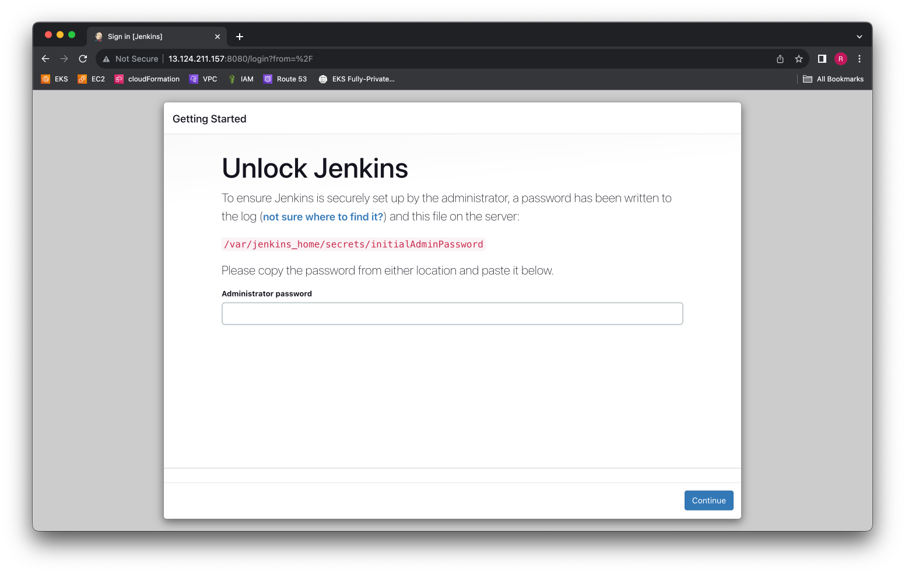
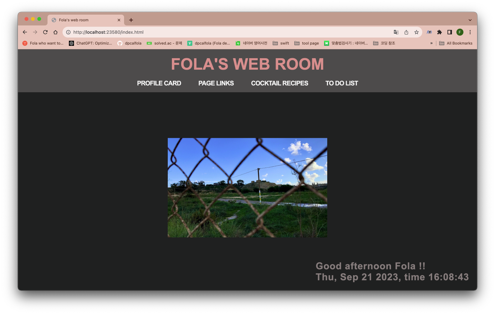

1. 인프라 구성

   - Cloudformation 사용
   - ./sources/CF-basic-infra-stack.yaml

2. AWS에 Jenkins 동작을 위한 인스턴스 생성

   - AMI: ubuntu 22.04
   - t3.medium
   - root volume EBS 100GB로 변경
   - public subnet

3. 인스턴스 내부로 접속

```shell
ssh -i <pem file> ubuntu@<public ip>
```

4. 툴 설치

```shell
sudo apt update -y

# docker engine
sudo apt install -y docker.io
docker --version
```

5. 젠킨스 설치 및 설정

- 여기서부터 루트로 스위치하여 작업

```shell
# 젠킨스 컨테이너 실행
docker run -d \
-p 8080:8080 \
--name jenkins \
-v /home/jenkins:/var/jenkins_home \
-v /var/run/docker.sock:/var/run/docker.sock \
-u root \
jenkins/jenkins:lts
```

```shell
# 젠킨스 내부에 도커엔진 설치
docker exec jenkins apt update
docker exec jenkins apt install -y docker.io

# 젠킨스 unlock code 획득
docker exec jenkins cat /var/jenkins_home/secrets/initialAdminPassword
```

6. 젠킨스 GUI 환경 접근
   

- 웹브라우저에서 url로 접근
  - URL: <인스턴스의 Public IP>:8080
- unlock code 입력
- 추천 설정으로 추가구성 패키지 설치

- 플러그인 설치
  - Dashboard -> Manage Jenkins -> Plugins -> Available plugins
  - Docker Pipeline 플러그인 설치

7. github setting

- github 엑세스 토큰 설정

  - (우상단) 프로필 이미지 -> Settings -> Developer settings(최하단) -> Personal access tokens -> Tokens(classic)
  - 토큰 생성
    - scope:
      - repo 전체
      - admin:repo_hook 전체
    - 토큰 생성 후 값 저장

- github webhook 설정
  - 작업 repository -> Settings -> Webhooks -> Add webhook
  - Payload URL
    - http://<publicIpAddress>:8080/github-webhook/
  - Content type
    - application/json

8. 젠킨스 Credentials

   - Manage Jenkins -> Credentials -> Stores scoped to Jenkins -> (global) -> +Add Credentials
   - kind
     - Username with password
   - Scope
     - Global
   - Username
     - github user name
   - password
     - github access token
   - ID
     - unlock code

9. Pipeline 만들기

   - New Item -> item name 입력 -> Pipeline 선택
   - General -> GitHub project 체크 -> 깃허브 URL 입력
   - Build Triggers -> GitHub hook trigger for GITScm polling 체크
   - Pipeline -> Definition -> Pipeline script from SCM 선택
     - SCM: Git
     - Repository URL: 깃허브 프로젝트 주소
     - Credentials: 깃허브 엑세스 토큰이 들어있는 Credentials 선택
   - Branch Specifier
     - _/main 으로 변경 (default: _/master)
   - Script Path
     - Jenkinsfile 입력
     - 프로젝트 레포지토리 루트에 Jenkinsfile 을 작성하여 위치시켜야 함

10. 정적 웹 호스팅을 위한 Dockerfile test

- 참고:

  - 정적 웹 소스코드:
    - https://github.com/dpcalfola/Fola-web-room.git

- 계획: 정적 웹 페이지를 아파치2 서버에서 실행

- Dockerfile code

```Dockerfile
FROM httpd:2.4
LABEL maintainer="github.com/dpcalfola"


# Copy all files to apache htdocs
COPY ./ /usr/local/apache2/htdocs/

# Execute apache
CMD ["httpd-foreground"]
```

- 로컬환경에서 동작 테스트

```shell
# 이미지 빌드
docker build -t fola_web_room:v1 .

# 컨테이너 실행
sudo docker run -d -p 23580:80 fola_web_room:v1
```

- 로컬환경에서 동작 확인
  

## 결과 - CI 구성 성공

- github repo의 main 브런치에
