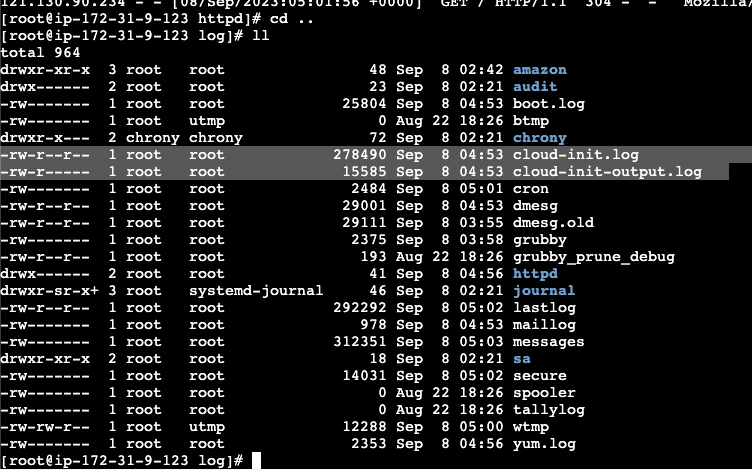

# Cloud Watch

- AWS 의 핵심 기능

- Amazon CloudWatch
  - 지표 
  - 대시보드 
  - 알람
- CloudWatch Agent
  - Amazon EC2
  - On-premise 서버

- EC2 cloudwatch logs
  - EC2 내부에서는 1분마다 집계하지만 cloudWatch 는 5분 평균치 전송

- CLooudWatch Agent
    - Role: CloudwatchAgentServerPolicy

