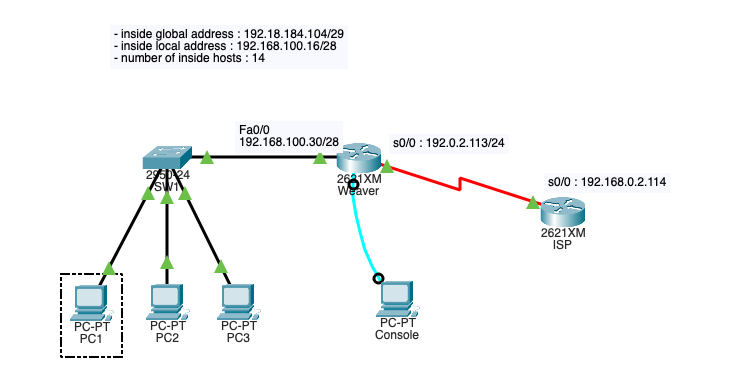
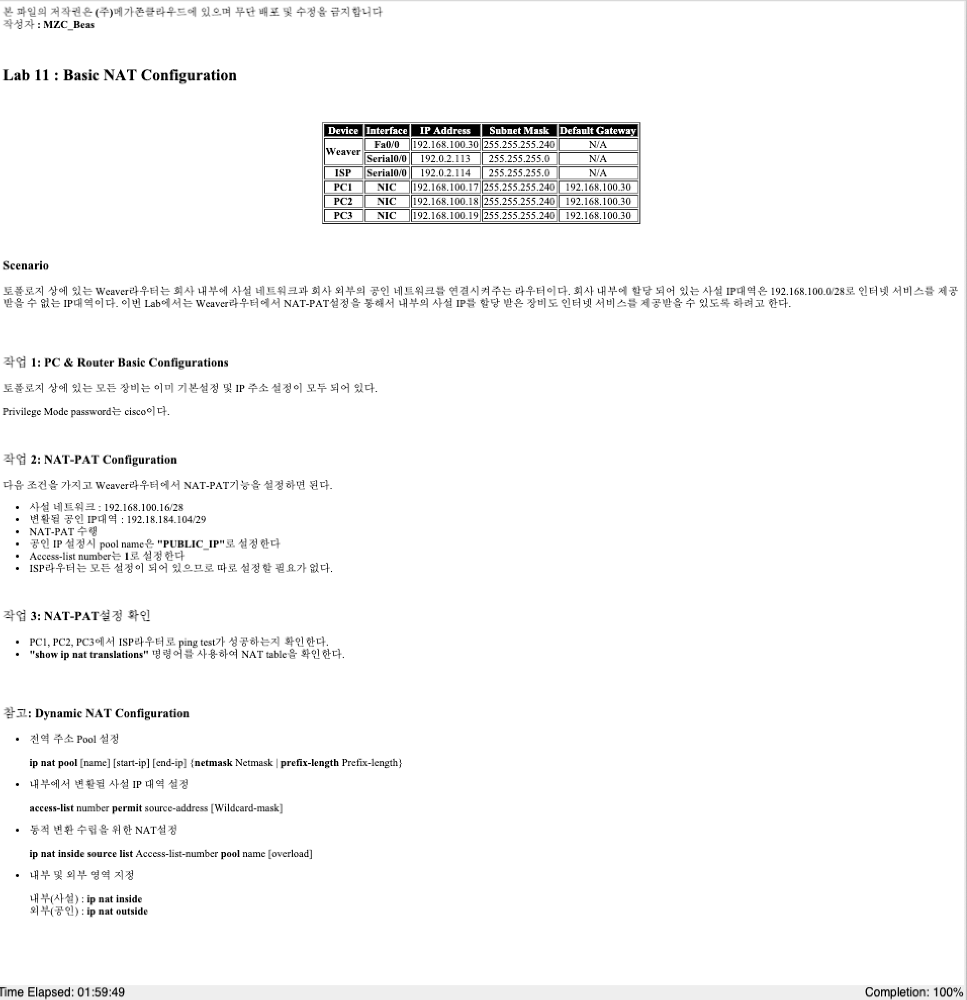

#### 문서 정보
- 작성자: 이은상
- 최초 작성일: 2022-06-22
- 수정 내역: Null


# 실습 가이드 - Basic NAT Configuration


## 문제





<br>


### Task 1. PC & Router Basic Configuration

- 기본설정 및 IP 주소 설정은 문제에서 제공되어있음
- Enable password: cisco


### Task 2. NAT-PAT Configuration

##### 1) 전역 주소 Pool 설정

- NAT 공인 아이피의 범위를 지정한다

명령어
```shell
# 양식
ip nat [name] [start-ip] [end-ip] netmask [netmask]

# 입력 명령어
ip nat PUBLIC_IP  
```


  